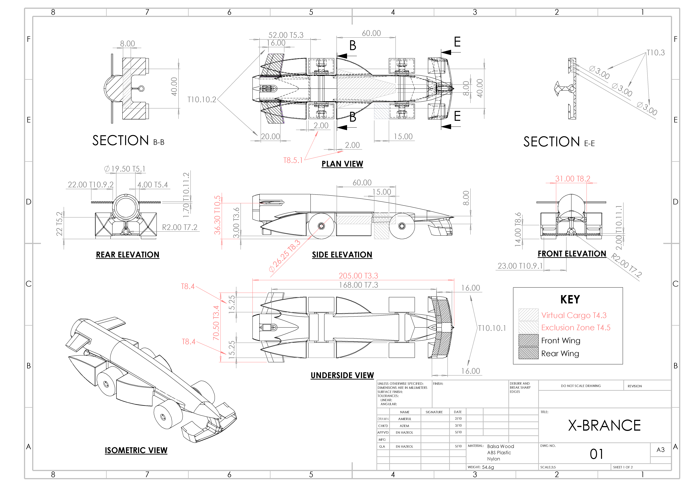

---
# the default layout is 'page'
icon: fas fa-info-circle
order: 4
---

Hi! I'm __Mohamad Amierul Hakeem__, penultimate year __MEng Mechatronics__ Student at the __University of Manchester__, on track for __first-class__ honours graduating in __Summer 2026__.

I am passionate about anything __electronics, robotics and embedded systems__ which can be seen with my involvemnt in a range of projects below.

> This is page is just a summary of my current/past projects. I am planning to write atleast one blog post for each of them soon in the future as the website is still new and i am currently busy with courseworks.

> I am currently actively looking for summer internship position for summer 2025. Here is my latest general CV in pdf version: [CV in .pdf version](/assets/general-cv-v2.1.pdf)
{: .prompt-info }

## Projects

### Formula Student Vehicle Control Unit (VCU) Development

{: w="600"}
_VCU PCB top view designed in Altium Designer_

The "brain" of our EV Formula Student car implemented with FreeRTOS, critical for managing core functionalities such as throttle control, telemetry and fault detection/handling.

[[VCU Github Repo]](https://github.com/ManchesterStingerMotorsports/f446-vcu)

### Autonomous Line Following Buggy

{: w="600"}
_Final race day: buggy picture_

Final Race Winner! Designed and built a custom autonomous buggy, programmed with Mbed in C++. Implemented cascaded PID control, state machine architecture, with multiple timer interrupts.

[[Buggy Github Repo]](https://github.com/Amrlxyz/esp-lfr-buggy), [[Article]](https://www.linkedin.com/pulse/2nd-year-embedded-systems-project-final-race-winner-hakeem-jfuzf)

### Formula Student Battery Management System (BMS)

{: w="600"}
_ADBMS Boards from Analog Devices connected in isoSPI daisy chain_

Microcontroller firmware that manages the safety of the car's 400V+ battery pack. It includes my own custom SPI-to-isoSPI hardware driver for communication with ADMBS ICs.

[[BMS Github Repo]](https://github.com/ManchesterStingerMotorsports/g474-bms)

### Brake System Plausibility Device (BSPD)

{: w="600"}
_BSPD top view designed in Kicad_

A safety-critical component of the car that performs plausibility check between brake pressure and throttle position only using non-programmable logic.

[[BSPD Github Repo]](https://github.com/ManchesterStingerMotorsports/BSPD), [[Schematic]](https://github.com/ManchesterStingerMotorsports/BSPD/blob/main/Documents/BSPD_V4_Schematic.pdf)

### UK Cansat Parachute and Landing Legs Deployment Design



As the Power Electronics Lead and CAD Lead, I am mostly involved in innovating a 2-stage landing and parachute deployment system with a single servo motor. The video is a test of the initial test of the 3d printeed landing gear prototype printed with my 3D printer. 

### Hexapod Spyders Project

{: w="600"}
_Designed the robot in SOLIDWORKS_ 

A more advanced robotics team project involving ROS (Robot Operating System). Involved with the hardware design and software simulation. 

### Maze Solver Robot

{: w="600"}
_Arduino uno based maze solver robot_

My first introduction to Arduino World. Implemented simple algorithm with motor feedback loop to solve the maze.

### F1 in Schools

{: w="600"}
_One of my best 3D renders made using only SOLIDWORKS_

{: w="600"}
_The drawing with dimensions of critical rules in red_

Used SOLIDWORKS to design the car and run FEA and CFD simulations to optimise its performance. Utilised CNC Milling and 3D Printing for precise and efficient manufacturing processes. Two times “Fastest Car Award” winner and represented Malaysia in the World Finals 2017.

## Skills

- Programming 
    - Embedded C/C++
    - Python
    - MATLAB & Simulink
    - VHDL
- PCB Design
    - Altium Designer
    - Kicad
- 3D CAD
    - SOLIDWORKS
    - Onshape
    - Fusion 360
- 3D Printing
    - Own Personal Hobby 3D Printer
- Linux
    - Ubuntu
    - Robot Operating System (ROS)
    - Debian based distros

## References

__Theodor Heath__ (3rd Year Project Supervisor) - [theodor.heath@manchester.ac.uk](mailto:theodor.heath@manchester.ac.uk) 

__Wuliang Yin__ (2nd Year Project Supervisor) - [wuliang.yin@manchester.ac.uk](mailto:wuliang.yin@manchester.ac.uk)  [[_Reference Letter_]](/assets/reference-letter.pdf)

